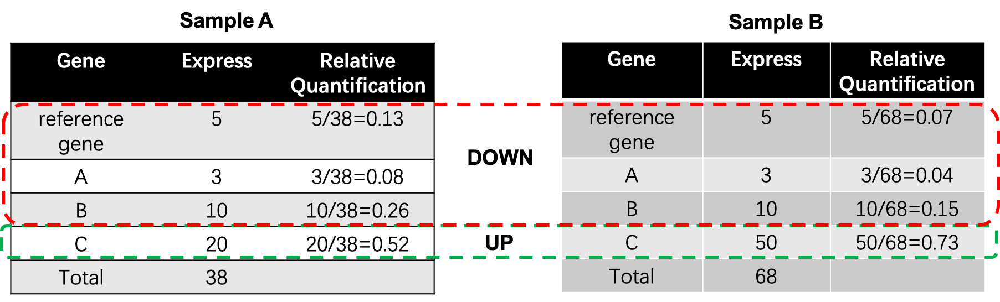

# RNADX
​		这是一个对RNA测序数据进行归一化和查找差异基因的方法，它通过**表达稳定的内参基因来对其他基因进行定量**，大大提高了样品间基因定量的稳定性，qPCR的验证率也有20%以上的提高。

# 原理介绍

​		传统的qPCR方法，会用一些表达稳定的内参基因（reference gene）作为标准，用其他基因的表达与标准内参作比较，得到基因的表达，如下图所示：


​		高通量测序，一般采用FPKM，CPM，TPM这些方法来计算基的因表达量，使用的是**求比例**的方法，即```单个基因的reads数/所有基因的reads```，在一些特殊情况下，某些基因表达量太高，影响了整体基因的定量和查找差异基因（比如核糖体的RNA表达都比较高），如下图所示：



​		为了解决这个问题，我们根据qPCR的原理，发明了**RNADX算法**，首先找到不同样品间表达稳定的内参基因，用类似qPCR的原理算出其他基因与内参基因的比例。但是根据我们的实际经验，有相当一部分样品（30-40%）的内参基因表达并不稳定或不表达，为此我们**在RNA建库的过程中，根据RNA的浓度加入了特定浓度稳定的外参基因**，在算法上用这些外参来纠正基因的表达，如下图所示：


# 效果评估

​		为了评估我们的算法准确度，我们用了植物基因组，动物基因组，还有糖尿病小鼠来做评估，评估指标如下：

1. 相关系数

   我们使用[corrplot](https://cran.r-project.org/web/packages/corrplot/index.html)这个R包来对样品的相关性进行计算，样品间的相关系数越高，说明样品间的基因表达相似度越高，找到的差异基因越精确。通常情况下，组内的相关系数要比组间的相关系数高，组内的相关系数最好大于0.9，组间大于0.7。

   * **动物样品**

   

这是一组雌雄个体RNA的数据比较，我们可以看出用了RNADX的定量，能大幅提升组间样品相关性。在FPKM组内相关性很好的情况下，RNADX算法也能提升一点。

   * **植物样品**

     

# 提供服务

1. **外参试剂**，用户可以在构建文库的时候，根据RNA浓度进行添加。
2. **实验外包**，用户可以把提好的RNA或者样品送寄来我们公司，我们对样品进行建库和测序。
3. **数据分析**，我们提供基因定量，新转录本构建，功能注释，差异分析，可变剪切分析，并提供一份结题报告。
4. **算法源码**，因为我们正在对这个方法进行文章撰写，暂时就不提供源码了。

# 常见问题

1. 我们已前测了好多转录组数据了，但是没有加外参，可以用这个软件进行分析吗？

   可以的，我们的软件会自动在样品间查到内参基因，用内参基因来对样品进行归一化。但是有些样品的内参基因表达不稳定，我们的软件会自动过滤掉这些样品，有些样品就没法用来分析了。样品越多，它们的共有内参基因就越少，根据我们的经验，9个样品以内，这个算法的效果还是可以的。

2. 目前有些公司，推出了“绝对定量”转录组，就是每条RNA加了分子标签（UMI），RNADX方法跟它比怎么样？

   我们要解决的问题是**基因定量，也就是数据归一化的问题**。加了UMI的转录组可以解决实验上某些RNA分子扩增过量造成的问题，但是如果分析人员最后还是用传统方法或者软件来定量分析，那所谓的“绝对定量”转录组，也只是某些公司的噱头，起的只有锦上添花的作用。

3. 你们提供的服务收费吗？

   嗯，收费。
   
4. 你们把分析原理写出来，不怕别人抄袭吗？

   这个加内参或外参的分析方法，在10几年前就有人发表过文章了，现在还有[ERCC的外参试剂](https://www.thermofisher.com/order/catalog/product/4456740#/4456740)卖。只是算法和实验没有相结合。另外很多事情看上去是挺简单的，但是做起来可没那么简单。别拿你的业余爱好跟我们这些靠技术吃饭的人来比较。

5. 你们的评估效果看上去很不错，是不是吹牛呀？

   没有吹牛，有时候太过优秀也会招人嫉恨。

# 联系我们

